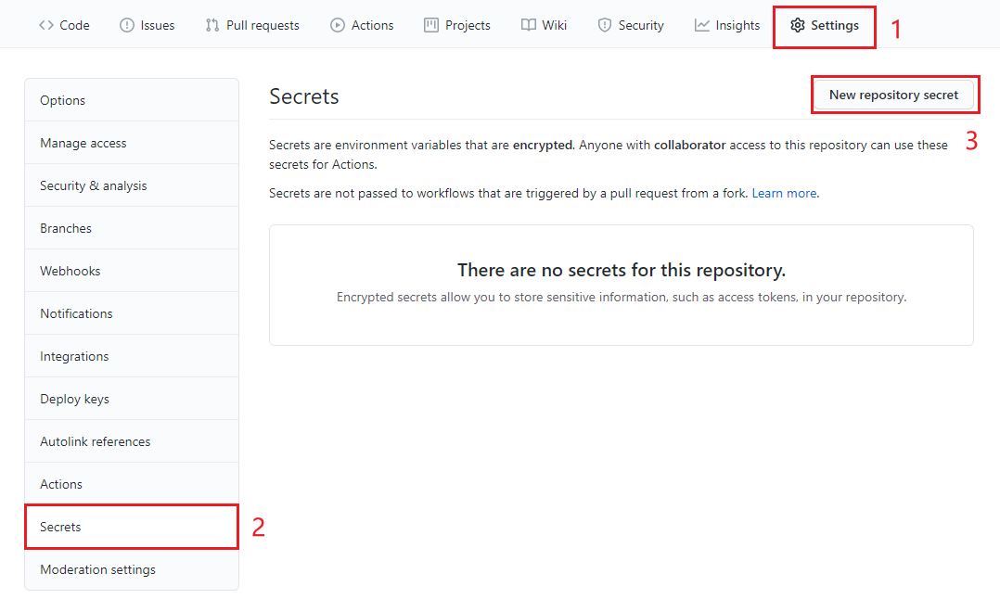
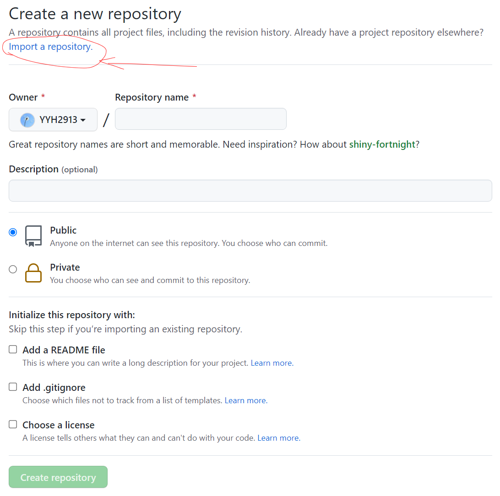
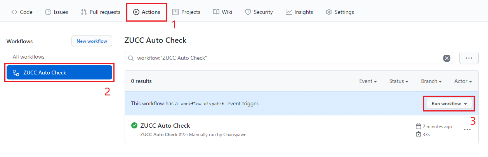

# ZUCC-AutoCheck 浙大城市学院自动健康打卡脚本

## 使用方法

### 配置

1. fork 该仓库

2. 点击仓库中的 `Setting` 标签，选中 `Secrets`

3. 选中 `New repository secret` 新建环境变量

   | Name          | Value            | Desc                                                         |
   | ------------- | ---------------- | ------------------------------------------------------------ |
   | SCHOOL_ID     | 学号             | 需通过 [统一身份认证](http://ca.zucc.edu.cn/cas/login)       |
   | PASSWORD      | 统一身份认证密码 | 需通过 [统一身份认证](http://ca.zucc.edu.cn/cas/login)       |
   | LOCATION      | 目前所在地       | 建议从 [打卡网页](http://yqdj.zucc.edu.cn/feiyan_api/h5/html/daka/daka.html) 选择填写后复制 |
   | AUTO_POSITION | 自动定位（新增） | 建议从 [打卡网页](http://yqdj.zucc.edu.cn/feiyan_api/h5/html/daka/daka.html) 选择填写后复制 |
   | SCKEY（选填） | 微信推送服务     | 详见 [Sever酱](http://sc.ftqq.com/) 配置微信推送打卡结果     |

### 使用

程序将在每天 8 点左右自动运行，也可以在 `Aciton` 中手动触发运行

